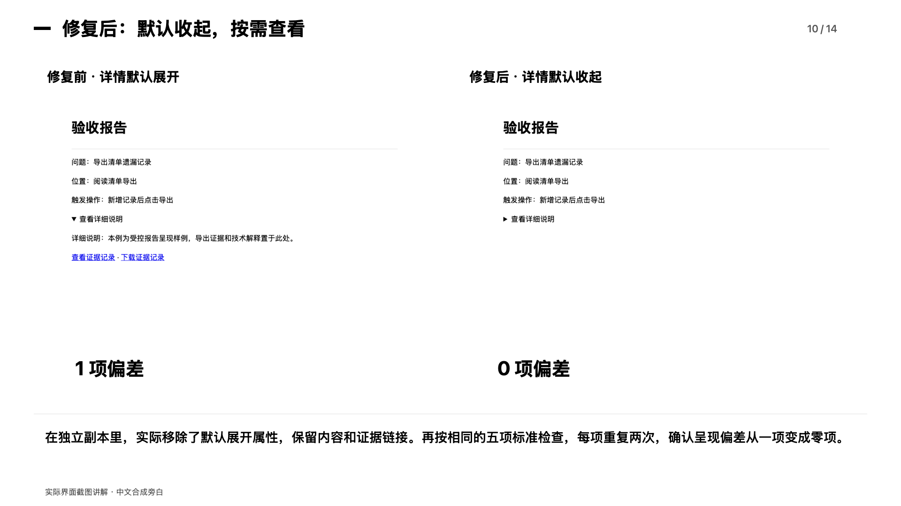

# 验收助手

**把个人经验变成可检查的下一步。** 中客松参赛作品，团队：默默无闻；队长及队员：杨海胜。

[魔搭在线体验](https://modelscope.cn/studios/mlhx0808/acceptance-assistant) · [修复对比记录](evaluation/report-repair-case.json)


## 检查自己的产品

本机启动后，点击 **检查我的产品 / 选择代码文件夹** → 选择含 `index.html` 的目录或构建后的 `dist` / `build` → 写目标 → 查看计划并开始。修改源码后重新选择文件夹接入新版本。

本地版已加入同目录修复关联、PDF/Codex 复检交接，以及基础网页重新上传时保留原标准。详见 [2026-09-16 发布说明](docs/acceptance/10-release-20260916.md)。公开魔搭仍只运行固定案例，自己的代码在本机接入。

如果项目需要完整业务路径检查，可在网页根目录放入 [`acceptance.spec.json` 示例](examples/acceptance.spec.example.json)。上传后系统自动按契约执行声明的路径、操作和确定性结果检查；契约外业务、后端和外部服务仍需专用适配器。[契约与五项闭环说明](docs/acceptance/24-project-contract-and-completion.md)。

[完整接入指南与支持范围](docs/acceptance/04-connect-your-project.md)

本地任务中断后继续执行会保存对应复检证据，源码变化时提示新建任务。见 [恢复验收说明](docs/acceptance/12-interrupted-repair.md)。

## 产品验收资料

[脱敏后的验收说明与记录](docs/acceptance/README.md)：使用指南、审评标准、历史检查摘要和受控记录。

## 下一版计划

[公开迭代看板](https://jilombmiker-alt.github.io/acceptance-assistant/iterations.html) · [产品框架](docs/next-version/01-product-framework.md) · [开发任务书](docs/next-version/02-next-development-brief.md) · [开发 SOP](docs/next-version/03-development-sop.md) · [状态与验收清单](docs/next-version/04-iteration-checklist.md)

先做深 Web 记录管理与文件导出，完成连续修复、同类迁移和用户收益验证，再扩展相邻能力。

## 能做什么

用户说清本次目标，系统结合主动提供的项目资料、历史纠正与本项目反馈，整理适用提醒、实际检查和下一步。开始验收后执行支持的本地页面路径，记录问题、位置、触发操作、预期和实际差异；修复后重新检查。可导出网页与 PDF 报告，或把项目上下文交给 Codex 继续使用。

每条经验说明来源、适用原因和具体改变。不会要求用户逐条整理规则；只在关键冲突时需要补充信息。

## 在线体验

打开上方魔搭链接，在对话框输入目标，选择内置版本，查看范围并开始检查。也可输入“查看案例”了解独立修复对比。线上使用受控阅读清单样例，实际在服务器运行检查；个人项目和历史资料通过下方本地版本接入。

## 本地启动

需要 Node.js 22+，首次安装浏览器。

```sh
npm install
npx playwright install chromium
npm start
```

打开 http://127.0.0.1:4395 。先点击“检查我的产品”选择代码文件夹；首次使用也可点“怎么开始”，或输入“查看案例”了解受控对比。自己的代码只在本机接入。

默认没有模型连接，可做基础检查。需要自动结合个人资料时，先自行安装、登录与本项目兼容的 Codex CLI，再运行 `npm run start:personal`。该传输使用受限 CLI 参数；不兼容或未配置时明确返回未完成，不伪造语义判断。模型服务可能使用远端推理和额度。

只读取主动选择的项目资料。项目地址和材料可通过“设置项目”修改，目录必须在启动时允许的项目根目录内。这个入口服务于本机使用。

## 使用顺序

1. 点击“检查我的产品”选择网页文件夹，再输入目标，例如“检查输入框和手机适配”。
2. 查看范围并开始检查；按报告的问题、位置和触发操作修复。
3. 修改源码后重新选择文件夹接入新版本；使用原目录及运行地址时，可输入“重新检查”。
4. 用“纠正：具体要求”留下项目反馈；一次性例外不直接变成永久规则。
5. 输入“带回 Codex”，把下载的上下文附到下一条 Codex 任务中。

在本仓库使用 Codex 时，也可直接运行 `npm run codex:context` 读取当前本机任务，无需手工附加文件。运行 `npm run study -- --init-local http://127.0.0.1:4395 标准草稿.json` 可从当前任务开始准备真人 A/B 效果记录。

高级工作台保留在 /workbench。

## 已验证的结果与边界

报告任务中，一条历史纠正增加四项实际检查。独立受控修复案例固定五项标准，每项重复两次：详情默认展开的呈现偏差从 1 项变为 0 项；已覆盖的展开、查看和下载证据路径没有回归。




该结果证明此处受控修复有效，不代表修复了示例报告文字描述的导出业务，也没有证明真人时间、返工成本或经济损耗节省。更少检查或更多检查都不直接等于个人历史带来收益。

当前不自动修改源代码、不自动采集其他聊天、不自动安装 Codex 全局记忆；任意业务、主观质量和任意 PDF 内容仍需专门验收。线上体验的范围是内置受控案例；下载后的本地版本可接入主动选择的项目。

## 本地连续修复练习

运行 `npm run start:repair`，在本地独立阅读清单副本完成“检查 → 修改代码 → 原标准复检”。启动后点“开始检查”；修改终端提示的副本后输入“重新检查”。[使用步骤和验收范围](docs/acceptance/14-reading-workflow.md)。

## 验证

```sh
npm test
npm run verify:repair
```

修复复现实验只改动新建的运行副本，并写入本地 runs；不改原样例。详细对比包含测试耗时，不能折算成人工节省。

## 发布范围

此仓库只包含运行所需源代码、受控样例、相关测试及对比记录。未包含原工作区私人运行历史、个人账号、凭据、其他项目源码或 node_modules。完整文件清单见 release-manifest.json。
