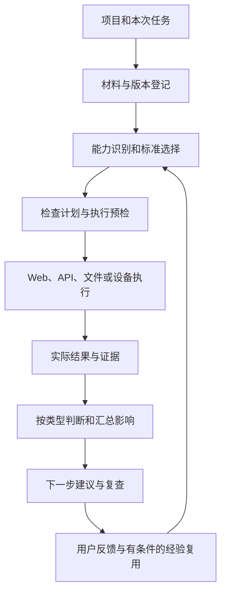

# 产品检验助手：产品全景、通用 SOP 与下一步决策

整理日期：2026-09-13。公开整理版。长期框架保留广度，版本执行先做深 Web 记录管理与文件导出，再依据迁移和用户收益证据扩展。当前勾选状态以《04-版本迭代与验收清单》为准。

本稿归档此前产品讨论及其代码、检查记录核对。公开整理仅修改文档，没有新增产品功能或重新执行全部验收。竞品部分核对官方资料，没有进行同任务横向实测，因此不作准确率、速度、价格或全面优劣排名。历史开发文档存在阶段差异，现状优先以具体模块和对应证据的范围为准。

## 1. 定位和“较为全能”的含义

长期定位：帮助产品负责人把一次交付目标转成适用的检查，执行能够可靠执行的部分，核对实际结果，解释已发现问题与未知项，并为后续处理提供有证据的建议。

较广覆盖依靠可组合的检查能力。对于缺少标准、环境或判断能力的项目，工具应准确说明缺少什么、对当前结论有什么影响、下一步如何补足。不能承诺任意产品自动全检，更不能由“没有发现问题”推出“保证没有问题”。

分别维护三套评价，不合并成一个总分：

| 评价对象 | 回答什么 | 所需证据 |
|---|---|---|
| 被测产品 | 本次目标和约定质量是否达到 | 需求、操作、实际产物、相应判定 |
| 验收助手 | 判断是否正确、覆盖是否诚实 | 独立答案、陌生案例、漏报误报复核 |
| 使用收益 | 用户是否少投入或得到更好结果 | 原有做法对照、人工时间、返工和额外成本 |

早期付费用户仍是待验证假设：持续交付 Demo、缺少专职测试、愿意提供已有需求与可运行项目的个人或小团队。长期跨品类定位与第一批验证用户分开管理。

## 2. 分类方式：先看任务，再由维度查漏

采用五个互相独立、可组合的轴，不把整个项目强制归入单一类别：

| 分类轴 | 需要识别的内容 | 如何改变检查 |
|---|---|---|
| 本次任务与终点 | 谁要完成什么；最后取得什么；何时结束 | 决定主路径、最终产物和停止点 |
| 能力类型 | 记录管理、交易、检索回答、生成、协作、代理执行等 | 选择对应业务 SOP 和判断器 |
| 运行载体 | Web、移动端、小程序、桌面、插件、API、设备 | 选择执行工具与环境矩阵 |
| 条件与风险 | 角色、租户、敏感数据、资金、外部依赖、离线、时限 | 增加约束、异常分支及必要的操作边界 |
| 交付阶段 | 交互原型、内部试用、生产发布、版本修复 | 明确当前承诺，选择适用验收标准 |

示例：一个“商品图工作台”可以同时拥有 Web 载体、图片生成、文件导出、多人协作和付费 API 标签。它需要生成结果、异步任务、文件、租户权限及成本检查。不能因为属于 AIGC 就忽略账号与数据一致性。

先由任务与能力标签选检查，再用质量维度查漏。某维度未触发时仍需解释是“不适用”“本轮排除”“暂不支持”还是“缺条件未验证”。不能在执行失败后改成不适用。

## 3. 质量框架：七维扩展为十二类

以下十二类是针对本产品的组织建议，不是某项国际标准的原样复述，也不是要求每个项目全部执行。现有“信息安全与可靠性”应分开；结果正确性向语义产物展开；性能同时记录资源成本。

| ID | 维度 | 细项示例 | 如何评判 | 当前边界 |
|---|---|---|---|---|
| D01 | 业务目标与功能逻辑 | 主路径、分支、业务状态、终点、异常输入 | 与明确业务规则及最终状态核对 | 阅读清单等已审核模板有证据；任意项目规划未完成 |
| D02 | 交互与反馈 | 输入、校验、提交、返回、取消、进度、错误反馈 | 动作前后状态、可恢复性和下一步是否明确 | 部分输入、原生详情和报告路径已实现 |
| D03 | 结果、内容与数据正确性 | 数值、状态、批次、文件内容、回答依据、生成主体 | 精确核对、领域规则、语义判断或人工审阅 | 部分 JSON 有证据；通用图像、长文和音频判断未完成 |
| D04 | UI 与任务可用性 | 信息层次、入口可发现、文案理解、完成任务负担 | 布局规则加用户独立走查 | 溢出、摘要折叠等局部证据；不等于全面易用性 |
| D05 | 无障碍与本地化 | 键盘、焦点、屏幕阅读器、字幕、语言、时区、日期金额 | 适用无障碍规则与目标地区样例 | 仅有局部键盘与布局记录，缺系统覆盖 |
| D06 | 身份、权限与隐私 | 登录、角色、租户、最小权限、数据生命周期 | 授权矩阵与实际资源访问、数据流核对 | 助手自身有局部保护；不等于被测产品权限正确 |
| D07 | 安全与滥用防护 | 注入、恶意文件、凭据泄漏、提示注入、工作流绕过 | 威胁模型及经授权的安全检查 | 目前为部分合成边界证据，缺通用安全适配 |
| D08 | 可靠性与恢复 | 网络中断、重复操作、并发、幂等、持久化、取消、恢复 | 故障前后状态及实际副作用 | 有局部任务控制、刷新与依赖证据；任意崩溃恢复未完成 |
| D09 | 性能、容量与资源成本 | 首次反馈、最终完成、并发、费用、内存电量 | 预先约定的阈值和真实测量 | 局部耗时与预算记录；无完整压测及真实成本覆盖 |
| D10 | 兼容性与互操作 | 浏览器、系统、设备、版本、协议、文件交换 | 受支持环境和系统间契约对照 | 部分窗口模拟与独立桌面记录，非通用设备矩阵 |
| D11 | 可观测性与维护 | 日志关联、错误定位、监控、配置、升级、回滚 | 故障能否定位、部署变更能否恢复 | 助手有运行证据与指纹，缺被测系统运维通用检查 |
| D12 | 领域规则与责任要求 | 行业规则、内容权利、保留政策、责任交接 | 当前适用且有来源的规则，必要时专业复核 | 尚无已验证领域规则包，不宣称自动合规认证 |

D05 的无障碍检查不能只用扫描器背书。W3C 明确说明部分检查需要人工判断。[W3C 工具选择说明](https://www.w3.org/WAI/test-evaluate/tools/selecting/)

D06 与 D07 应检查实际授权行为，不能以按钮隐藏代替资源权限检查。OWASP 将身份认证、授权与业务逻辑分别展开，可作为规则包的来源之一。[OWASP 测试方法](https://wstg.owasp.org/latest/4-Web_Application_Security_Testing/00-Introduction_and_Objectives/)

用户需求是否真实、是否愿意持续用或付费，放在产品价值研究中。技术质量检查无法单独回答这些问题。

## 4. 产品能力类型与专属 SOP

类型允许重叠。检查应落到具体板块，而不是先判断“整个产品是什么”才开始。

| 类型 | 任务与典型主路径 | 专属判断点 | 必备依据/条件 |
|---|---|---|---|
| 记录与管理工具 | 新增、编辑、筛选、保存、重开、导出 | 状态一致、过滤边界、恢复后记录、导出范围 | 字段定义、业务约定、测试数据 |
| 交易与订单 | 选择、报价、下单、支付、履约、取消退款 | 金额库存、订单终态、重复请求、回调乱序 | 规则、测试账户、沙箱支付与可信结果查询 |
| 多人协作与审批 | 创建、邀请、编辑、审批、撤权 | 多角色可见性、租户隔离、并发覆盖、审批不可跳级 | 角色矩阵、多账号及状态转换规则 |
| 搜索、知识库、RAG | 提问、检索、回答、引用、追问 | 检索权限与时效、答案支持、引用关联、无答案处理 | 固定语料快照、问题集、专家确认的判定条件 |
| 图片、视频、音频生成 | 输入素材、提交、观察、取得产物、修改、导出 | 主体保持、指令完成、时序/声音质量、批次关联 | 原素材、明确要求、参考、真实生成接口和成本范围 |
| Agent、RPA 与工具调用 | 理解目标、选工具、执行多步、取得业务结果 | 工具与参数、权限、重复副作用、实际终态、人工接管 | 工具契约、可观察日志、隔离测试目标 |
| 数据处理与分析 | 导入、转换、聚合、图表、报告、导出 | 单位、精度、缺失值、重复值、来源和计算一致性 | 独立样本答案、数据字典、运算规则 |
| 实时通信与语音 | 连接、收发、打断、断线、重连、结束 | 延迟、丢失、乱序、识别错误、回声、消息一致性 | 双端环境、音频/网络条件、结束标准 |
| 游戏与互动内容 | 新建、选择、推进、保存、读取、结局 | 分支可达、资源状态、规则一致、存档兼容 | 状态规则、随机性配置、设计目标；趣味性另做用户研究 |
| 平台、API、SDK 与插件 | 接入、认证、调用、错误处理、升级 | 契约兼容、限流、重试、宿主权限、跨版本影响 | 接口定义、宿主环境、支持版本 |
| 设备与跨端系统 | 发现、连接、指令、实体动作、断开、恢复 | 软件反馈与实体动作一致、离线安全、设备状态 | 真机、固件、可控环境及必要人工观察 |

移动 App、小程序、桌面应用是运行载体，通常与上表多类能力组合。教育、医疗、金融等行业也是条件标签，需要另外加载领域规则，不直接照搬普通 Web Demo 的标准。

当前公开阅读清单案例用于状态和文件检查。其他品类仅作为后续能力设计方向，不计为已验证支持。

## 5. 通用 SOP：每个阶段的输入、动作与输出

| 步骤 | 核心动作 | 必须产生的结果 | 无法继续时 |
|---|---|---|---|
| S01 接入 | 接收目录/入口、已有材料和一句任务目标 | 项目、版本、环境、材料出处 | 标明缺少可运行环境，保留可做的只读分析 |
| S02 明确任务 | 识别角色、起点、终点、交付阶段与副作用 | 本轮验收契约草稿 | 仅追问会改变结果的冲突，不让用户重写整份 PRD |
| S03 选取标准 | 能力标签选规则，维度检查遗漏 | 适用标准、来源、版本、阈值、未知项 | 标准不明则保留待确认，不能由当前界面反推正确答案 |
| S04 建立计划 | 识别主路径、分支、依赖和最终产物 | 可审阅计划及覆盖清单 | 未支持与缺条件分别记录 |
| S05 预检 | 校验动作、对象、预算、数据、环境和终点 | 可执行且在授权范围内的计划 | 拒绝无效计划，独立只读任务可继续 |
| S06 执行观察 | 用对应工具执行，跟踪同一任务 | 动作日志、页面/接口状态、产物和副作用证据 | 区分被测缺陷、执行器错误、外部受阻 |
| S07 判断与复验 | 根据判定类型核对结果，按策略采样/复验 | 逐项结论、证据、不确定性、首次异常 | 不能取得足够证据则待判断，避免无条件重放提交 |
| S08 汇总影响 | 合并重复问题，关联用户终点和受影响分支 | 问题、位置、触发操作，展开查看依据与影响 | 不把同一前置失败的所有依赖算作独立缺陷 |
| S09 辅助决策 | 在明确约束下提出可选下一步 | 建议、理由、代价、待补证据和复查条件 | 有关键不确定性时优先提出最小补充验证 |
| S10 修改后复查与沉淀 | 关联修复版本、同一标准、相关路径及反馈 | 修复结论、回归范围、适用经验和实际使用效果 | 同版本重跑不算修复；没有真人测量不算提效 |

每条检查要能回答：检查什么、为什么适用、怎么操作、结果在哪里、何种条件算满足、没做到属于什么状态、谁可以据此作决定。

状态至少分开：符合要求、发现偏差、缺证据待判断、前置受阻、工具暂不支持、本轮范围外、不适用。它们不与运行中的“执行中、暂停、已结束”混用。“已结束”仅表示执行生命周期结束。

运行原则：先判断任务是否真实存在，再决定是否等待；先判断动作是否发生，再决定是否重试；先判断结果是否取得，再判断质量；完成本轮约定后结束，不自动无限扩大优化范围。

## 6. 通用检查模块包含什么

这里的“通用”指跨产品可复用的框架，不代表目前已全部支持。

| 模块 | 普遍需要核对的内容 | 触发条件 |
|---|---|---|
| 入口与前置 | 页面/服务可访问、配置可用、登录状态、必要数据 | 所有执行任务 |
| 输入与校验 | 有效/无效/边界输入、回读、必填逻辑、上传格式 | 存在输入或文件 |
| 交互与导航 | 提交、返回、取消、撤销、重复点击、焦点与错误提示 | 有用户操作 |
| 状态与持久化 | 保存、刷新、离开重开、角色切换、并发更新 | 存在状态或跨步骤数据 |
| 异步生命周期 | 任务真实创建、状态反馈、原任务查询、取消和结果关联 | 排队、生成、审批、长计算 |
| 实际产物 | 能取得、能打开、格式正确、对应本次输入、内容满足要求 | 文件、答案、图像或业务结果 |
| 多端与身份 | 环境矩阵、角色/租户、权限撤销后的行为 | 有相关角色或支持范围 |
| 异常与恢复 | 断网、失败、超时、重试、重复请求、恢复后的副作用 | 与本轮风险和任务有关 |
| 使用负担 | 用户能否找到入口、理解结果、独立完成 | 产品可用性研究或目标明确要求 |

“答案生成”不是所有产品都有的基础项，应作为适用时加载的产物模块。通用的是验证最终产物，具体判断器随产物变化。

### 6.1 四种判定方法

1. **精确判断**：金额、数量、状态、ID、格式，用确定性代码与独立来源核对。
2. **规则与性质判断**：排序、汇总、状态不变量、权限矩阵、重复请求效果，用业务规则或输入变换检查。
3. **语义判断**：答案是否得到材料支持、主体是否保持、指令是否完成，采用明确量表、校准过的模型判断和必要人工复核。模型不能用自己的解释证明自己正确。
4. **用户/专业判断**：审美、趣味性、可信感、工作流是否符合真实需求，需要代表性使用者或专业人员。AI 可以组织证据、提出候选标准和比较结果。

LangSmith 官方文档也区分人工、代码、模型裁判和成对比较等评估方式；它们可以组合使用。[LangSmith 评估概念](https://docs.langchain.com/langsmith/evaluation-concepts)

### 6.2 三个具体的品类 SOP

**阅读清单：确定性数据结果。** 要求导出全部书目与当前阅读状态一致。新增两本、标记其中一本已读、筛选后返回全部、刷新、下载、解析文件、逐项核对书目 ID/名称与状态。现有受控案例记录《山海笔记》页面已读而导出未读。本轮不能改写为“漏了一本书”。

**RAG：来源与答案结果。** 固定语料版本及角色，准备可回答、无答案、材料冲突、资料过期、无权限与多轮追问任务。分别检查检索到了什么、答案主张是否得到可访问证据支持、引用是否对应主张、未知时怎样处理。检索成功不能替代回答质量；回答流畅不能替代事实正确。需要未进入调优过程的新问题集。

**商品图生成：异步任务与多模态结果。** 固定原始商品图和要求，例如改背景而保留主体标识与颜色。核对后台是否实际创建任务，追踪同一任务，取得真实图片，再检查主体、明确编辑要求、批次及导出文件。如果“等待结果”实际要求用户去其他工具生成，应先指出流程与任务要求冲突。只得到图片但商品主体改错，任务仍不符合要求。主观审美使用参考和人工判断，不随意转成全局分数。

### 6.3 重复几次、等多久

- 确定性路径的两次执行可用作基础复现检查，但不能证明没有偶发故障。增加不同输入、环境或状态，比机械重复同一例子更有信息量。
- 随机生成应在预先固定的问题/素材集上做多次采样，保留模型配置，报告样本数、失败分布和不确定性，不能以两次成功宣称稳定。
- 首次反馈时间、预计完成时间、最长观察预算分别记录。预算来自服务说明、历史实测、任务紧迫程度和用户约束，缺少依据就标未知。
- 等待期间优先查询原任务。未知结果的支付、发送、删除和付费生成动作，不因超时自动重放；应先查实际业务状态或使用经验证的幂等机制。
- 一次明确越权或错误副作用就保留问题，不为凑重复次数再造成同类影响。测试应在许可范围和可控环境进行。
- 原三到五次恢复讨论不能成为所有产品的统一重试常量。每份 SOP 分别声明观察重试、定位恢复、动作重放和取样次数。

## 7. 可扩展架构与开发数据对象

横向能力：身份和动作授权、数据保护、证据版本与完整性、运行状态、费用与等待记录。规则内容、工具执行和用户界面分开维护。

| 建议数据对象 | 主要字段 | 用途 |
|---|---|---|
| 项目档案 | projectId、版本、载体、角色、能力标签、数据敏感性、依赖 | 选择适配器和规则 |
| 验收契约 | taskId、用户目标、起终点、标准来源、范围、允许动作、预算、版本 | 防止任务和正确答案漂移 |
| 检查项 | requirementId、维度、适用条件、输入、动作、预期、判定器、证据需求、复验策略 | 让规则可执行且可追溯 |
| 执行记录 | 计划版本、工具版本、动作、任务 ID、实际状态、耗时、副作用 | 解释发生了什么 |
| 问题记录 | requirementId、预期/实际、位置、触发步骤、证据状态、影响、原因假设 | 让用户找到并理解问题 |
| 决策建议 | 目标、建议动作、支持证据、替代选项、约束、代价、未知项、复查标准 | 让用户作下一步选择 |
| 经验案例 | 来源、适用条件、用户纠正、已否定方案、结果、失效条件、反馈 | 仅在适用时补充当前任务 |

规则包应声明版本、适用条件、所需适配器、输入样本、阈值来源、已验证范围和不支持状态。插件化只是组织方式，规则包质量仍要独立测评。

当前代码可沿用的落点：`v2/inspect.mjs` 材料登记，`v3/planner.mjs` 基础计划，`v3/auto-experience.mjs` 有来源语义条件，`v2/plan-validation.mjs` 计划预检，`v2/engine.mjs` 执行，`lib/authorization.mjs` 操作权限，`v2/task-control.mjs` 状态控制，`v3/report-journeys.mjs` 报告路径，`v3/help-evaluation.mjs` 帮助效果，`v3/report-export.mjs` 报告导出。这是候选扩展方向，不要求全部重写。

特别避免直接把 `dimensions` 数组从 7 改成 12 就宣布覆盖升级。原覆盖矩阵大量项仍为 unsupported；需要同步增加适用判定、实际检查器、结果映射和证据。

## 8. 当前有什么，尚缺什么

| 能力 | 本轮核对到的现状 | 待补能力 |
|---|---|---|
| 项目接入 | 有本地目录、已运行页面、材料扫描和指纹 | 陌生工程可靠准备、多载体环境、支持清单 |
| 基础规划 | 当前规划器覆盖入口、明确文字、输入回读和部分布局 | 业务意图、复杂路径与最终预期的可靠提取 |
| 阅读清单业务 | 已审核计划有 8 条路径、每条 2 次的记录，导出状态偏差被复现 | 陌生同类项目迁移和独立答案复核 |
| AI 条件整理 | 真实模型在受控报告案例中引用纠正，映射支持检查 | 任意业务动作与多模态标准映射 |
| 动作与任务控制 | 有合成授权、暂停继续、缩范围和依赖阻断证据 | 任意步骤崩溃恢复、复杂跨系统副作用和真实环境验证 |
| 证据与报告 | 有实际页面、JSON、重复记录、HTML/PDF 导出 | 更多产物类型、非 DOM 隐私识别、完整分享与生命周期管理 |
| 问题分级 | 报告案例按目标失败、已验证替代路径和呈现问题分级 | 跨类型业务影响与发布风险判断 |
| 修改后复查 | 报告默认折叠的受控修复有前后证据 | 自动影响分析、阅读清单同一导出问题连续修复记录 |
| 下一步帮助 | `decisionHelp` 按结果提示补条件、修改后验收或继续验证帮助 | 方案比较、代价依据、发布取舍与决策有效性验证 |
| 个人价值 | 有冻结对照标准、结果与收益分开、未知值保留的机制 | 陌生任务 A/B、独立用户操作、真实返工与成本测量 |

不要把“助手保护自己的扫描/截图”算作“已验证被测产品的隐私和权限”。这两条工作流要分别设计。

## 9. 优点、缺陷与竞品对照

### 9.1 当前能够支持的优点

- 把最终产物与本轮要求关联，而非只记录页面动作。
- 保留依据、执行、结果和未知项，用户可以回查。
- 已开始处理依赖失败、有限恢复、范围边界及历史适用。
- 个人纠正可关联到支持的具体检查，保留未应用/未执行状态。

这些是当前设计与局部机制优势，不是相对所有竞品的独有优势。

### 9.2 当前缺陷

- 通用规划和语义结果判断明显受限，人工分析仍占较大比重。
- 能力类型、运行环境与规则包尚未形成统一且经过验证的支持矩阵。
- 阅读清单完整业务模板与报告语义案例是不同证据链，不能合并成任意项目自主验收。
- 缺少陌生用户、陌生项目及公平强基线的比较。
- 接入与维护成本未量化，跨品类定制可能消耗大量人工。
- 下一步建议多为状态驱动提示，尚未证明用户采纳后更好。

### 9.3 下一版要比较的替代方案

| 对照对象 | 要回答的问题 | 公平条件 |
|---|---|---|
| Excel 加人工 | 本工具是否真的减少整轮人工投入 | 相同标准、相同交付质量，计入接入和整理 |
| 已有固定测试 | 有明确断言时，新增语义步骤是否值得 | 相同覆盖，计入准备、维护与误报处理 |
| 接有执行工具的大模型或编程助手 | 本产品是否减少反复解释和交接 | 同等模型、材料、工具权限和预算 |
| 专业测试与评估工具 | 哪些能力应复用，哪些问题仍待解决 | 下一阶段核对当时版本并做同任务实测 |

目前没有同任务横向实测，不宣称优于替代方案。独立产品、插件或带人工服务的形态，依据验证结果决定。

## 10. 辅助用户决策：四个层级

这层能力不靠“多给几个见解”成立。决策依据应来自本次目标、实际证据、任务依赖、影响范围、用户约束和经过验证的历史案例。品类知识帮助解释，不能覆盖明确的当前要求或替代事实。

| 层级 | 用户在决定什么 | 必需依据 | 当前状态 |
|---|---|---|---|
| L1 运行控制 | 等待、补条件、暂停、继续、跳过还是结束 | 真实任务状态、依赖、授权、剩余预算 | 有部分运行控制与提示逻辑 |
| L2 修复与复查 | 先查哪里、交给谁、修完复查哪些条件 | 问题证据、影响路径、原因假设与区分方法 | 有报告与交接、局部修复案例，通用影响分析欠缺 |
| L3 交付取舍 | 修完再交付、限定试用、接受某项已知限制 | 必须项、风险、替代路径、试用范围和负责人授权 | 未形成已验证的跨品类决策能力 |
| L4 产品方向 | 值不值得增加功能、换路线、调整目标用户 | 用户研究、行为数据、成本收益、战略约束 | 不能仅从测试报告推导，需单独研究验证 |

### 10.1 建议的生成流程

1. **先核实证据。** 环境不可用、标准冲突或结果尚未取得时，不能强行给修复结论。
2. **关联目标与依赖。** 这个问题阻止哪个用户完成哪个终点？是否存在实际验证过的替代路径？
3. **应用硬约束。** 明确必须项、数据损失、越权等不能被大量次要通过项抵消。
4. **列出有限选项。** 例如修复、补充验证、缩小交付范围或延期；每项说明代价和保留风险，未知成本标未知。
5. **按用户约束排序。** 结合影响、受影响范围、截止时间、可逆性、处理成本及证据强弱，不使用未经校准的万能加权分数。
6. **给出复查条件。** 用户执行建议后，通过哪个任务和产物确认有效？
7. **保留采纳与后果。** 用户选择不等于正确；记录结果，并用于后续校准。

优先级和原因确定性分开：问题影响可能很大，但原因仍可能未知。这时下一步应是高优先级的定位验证，而不是高自信的修复指令。

### 10.2 一个建议必须包含的内容

> 本轮目标；已确认问题及证据；对目标的影响；建议下一步；可选方案及代价；仍未知的部分；需要谁决定；怎样复查。

界面默认只显示问题、位置、触发操作和最关键的下一步，完整推理按需展开。不要把所有维度和政策都变成用户必填表。

### 10.3 阅读清单的具体建议

目标：交付能够正确导出阅读状态的 Demo。

事实：本轮《山海笔记》页面已读，文件 read=false，重复检查仍出现。

影响：必需的导出结果不符合要求。其他路径通过不能抵消这条失败。

下一步：将复现路径、输入、预期与实际文件交给开发者，优先核对导出时读取的数据及状态映射。具体原因尚不能从页面与文件差异直接确定。

复查：在新版本上核对同一问题，并增加全部未读、混合状态、状态修改后、筛选后导出和刷新后导出的用例。依据现有约定，筛选后仍导出全部书目与状态。

若用户想先做内部试用：需要明确试用是否允许关闭或限制导出功能。助手可以陈述选项，不能自己修改交付要求并把该项记为通过。

### 10.4 AIGC 等待状态的不同建议

- 能查询到真实任务且仍在合理执行：观察原任务，保留进度和剩余预算。
- 页面显示等待，实际没有自动生成能力：报告流程缺口，不用增加等待掩盖。
- 图已生成但结果未回流：定位结果交接，先核对任务与产物关联，避免重复付费生成。
- 结果已取得但主体被改坏：转到内容质量问题，增加重试次数不是充分解决办法。
- 无法确认任务是否发生：保留待判断，先查可信业务状态。

这些建议来自状态和证据差异，品类 SOP 负责定义该看哪些状态。

## 11. 怎样检验“建议”本身有用

| 检验 | 方法 | 主要指标 |
|---|---|---|
| 逻辑正确性 | 人工预标问题、缺证据、前置受阻和有替代路径案例 | 错误归因、漏掉硬约束、建议可执行性 |
| 证据充分性 | 隐藏部分日志或材料，观察建议是否收敛或要求补证 | 无证据强判断、正确保留未知、关键补问负担 |
| 实际处理效果 | 固定问题与版本，由开发者按材料修复后复查 | 修复结果、遗漏回归、额外返工和处理投入 |
| 用户决策收益 | 相近任务分别提供报告、报告加建议 | 正确选择下一步的比例、耗时、求助及额外成本 |
| 个人历史增益 | 相同能力，只增加相关历史材料 | 是否减少重述/漏检，是否错误迁移旧要求 |

每批比较预先确定主要指标与有意义的改善幅度。记录样本数、失败情况和成本，不事后挑有利指标。模型不同意用户不必然是错误，用户采纳也不必然是正确，应回到明确目标、约束和后续结果。

## 12. 分阶段开发顺序及退出条件

| 阶段 | 交付物 | 完成的判断 | 不应提前扩展 |
|---|---|---|---|
| P0 统一任务与证据 | 验收契约、状态体系、标准出处、问题与复查关联 | 阅读清单同一导出问题完成发现、修改、原标准复查；缺项如实保留 | 不直接把所有维度改成“支持” |
| P1 一类产品可迁移 | 记录管理规则包、任务识别、Web/文件执行与决策 L1/L2 | 在未参与模板编写的同类项目上，独立核对结果和接入成本 | 不先做所有行业定制 |
| P2 垂类用户收益 | 记录管理真实任务、强基线与独立用户对照 | 达到预先约定质量门槛，净人工投入或质量有可复核改善 | 不先扩展新语义品类 |
| P3 一种相邻能力 | 在 RAG 或 AIGC 中只选一类，真实产物、量表和人工校准 | P0–P2 达标，且新样本集有独立漏判误判记录 | 不同时铺开多模态 |
| P4 扩展载体和规则 | API、真机、桌面、协作等适配器及版本化规则 | 每新增一类都有独立样例、错误边界和使用证据 | 不以接上工具等同于支持完整产品 |

每阶段都允许出现“无增益、成本过高、标准无法可靠取得”的结果，并据此改变适用范围或产品形态。

## 13. 下一次开发的验收要求

1. 开发开始前写出本批目标、支持和不支持的情况、使用的现有模块及独立检查方法。
2. 前台沿用简洁入口，自动整理已有材料；只对影响结果的冲突追问。
3. 每个展示为支持的功能都有可运行路径与证据，演示材料区分产品自动完成和开发助手临时分析。
4. 当前目标、标准来源、检查项、执行记录、问题和修复版本能追溯关联。
5. 保留发现偏差、待判断、受阻、未支持、范围外、不适用的区别；不可互相偷换。
6. 语义模型只能提出符合 schema 的候选判断，执行权限、工具动作和记录完整性由程序约束。
7. 更换产品实现或输入后仍能工作；不能把样例答案放入执行器以通过演示。
8. 结果页默认简洁。问题展开后能看到依据、证据、影响和建议的未知项。
9. 对照采用强基线，保留接入和维护成本；没有实测数据就显示未测得。
10. 本批完成后交付可运行入口、一个完整案例、未完成清单及下一批推荐，不以增加清单长度作为成果。

## 14. 公开依据与下一步

- [当前源码](../../v3/public-demo.mjs)
- [受控报告修复记录](../../evaluation/report-repair-case.json)
- [下一次开发任务书](02-next-development-brief.md)
- [开发执行 SOP](03-development-sop.md)
- [当前状态与验收清单](04-iteration-checklist.md)

文档中的十二类维度和数据对象是设计框架，不等于当前程序已经支持。局部机制、线上受控案例、真实用户收益分别记录。
